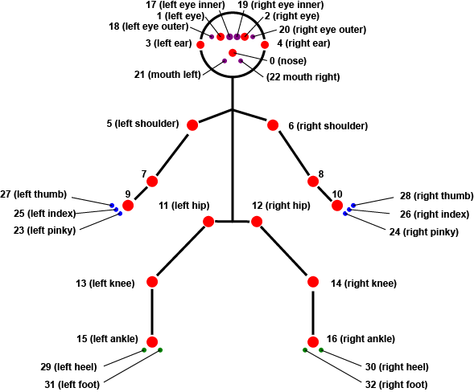

# MovementOSC
An application that detects body keypoints using Tensorflow.js' MoveNet models, and sends the data over Open Sound Control (OSC).

Currently, MovementOSC supports the following models:
1. MoveNet Multi-pose Lightning v1 (can detect multiple bodies at once)
2. MoveNet Single-pose Thunder v4 (highest accuracy)
3. MoveNet Single-pose Lightning v4 (lowest latency)
4. BlazePose Heavy (higher accuracy, 33 key points, single pose)
5. BlazePose Full (lower latency accuracy, 33 key points, single pose)

MovementOSC is an Electron-based app that is supported on macOS, Windows, and Linux. It works fully offline.

## Keypoints

MovementOSC provides a normalized keypoint format that is consistent across all its supported models:

* 33 keypoints in total
* the first 16 keypoints are the COCO set
* the remaining 17 keypoints are those unique to BlazePose, in order from head to toe
* regardless of which model you use, all 33 keypoints will be provided; keypoints that aren't supported by the model, or which don't meet the specified minimum score, will be set to NaN

### List of Keypoints

```
0: nose
1: left_eye
2: right_eye
3: left_ear
4: right_ear
5: left_shoulder
6: right_shoulder
7: left_elbow
8: right_elbow
9: left_wrist
10: right_wrist
11: left_hip
12: right_hip
13: left_knee
14: right_knee
15: left_ankle
16: right_ankle
17: left_eye_inner
18: left_eye_outer
19: right_eye_inner
20: right_eye_outer
21: mouth_left
22: mouth_right
23: left_pinky
24: right_pinky
25: left_index
26: right_index
27: left_thumb
28: right_thumb
29: left_heel
30: right_heel
31: left_foot_index
32: right_foot_index
```

### Keypoint Diagram




# Credits
MovementOSC is Copyright 2024 [Kinetic Light](https://kineticlight.org) and [Lichen Community Systems Worker Cooperative Canada](https://lichen.coop), and was created by [Colin Clark](https://colinclark.org).
